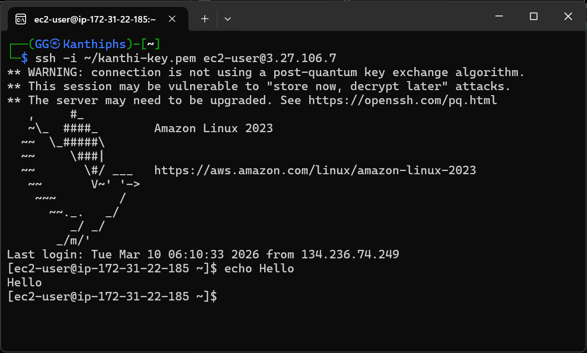

# ☁️ Project #4 — EC2 Instance + SSH Setup

**Author:** Kanthi Phoosorn  
**Date:** March 10, 2026  
**Part of:** [Cloud-Security-Engineer Portfolio](https://github.com/KanthiPhoosorn/Cloud-Security-Engineer)

## 📋 What I Did
- Launched AWS EC2 t2.micro instance (Amazon Linux 2023)
- Created RSA key pair for secure SSH access
- Connected via SSH using Kali Linux WSL2
- Updated server packages with yum
- Installed Python3-pip and Boto3

## 🛠️ Technologies Used
- AWS EC2 (t2.micro — Free Tier)
- Amazon Linux 2023
- SSH (RSA key authentication)
- Kali Linux WSL2
- Python3 + Boto3

## 🔐 SSH Connection Command
```bash
ssh -i ~/kanthi-key.pem ec2-user@3.27.106.7
```

## 📸 Screenshot


## 💡 What I Learned
- Cloud server provisioning on AWS
- SSH key-based authentication
- EC2 free tier management
- Linux server basics on cloud

## 🔗 Related Projects
- [Project #3 — Static Website](https://github.com/KanthiPhoosorn/Project-3-Static-Website-on-AWS-S3)
- [Project #5 — Auto Backup to S3](https://github.com/KanthiPhoosorn/Project-5-AWS-Auto-Backup-S3)
```
